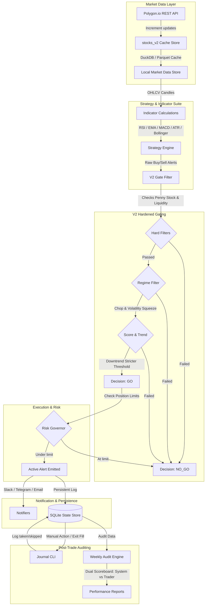

# 📈 Professional Stock Trading Strategy & Execution Application (Trade-App-V2)

Trade-App-V2 is a production-ready, professional-grade algorithmic trading and decision-support system designed to identify, screen, execute, track, and audit high-probability trading signals on US equities. Leveraging real-time data from Polygon.io, an ultra-fast DuckDB/Parquet local market data caching layer, and a robust fail-closed regime gating engine, the system ensures disciplined execution and precise risk management.

With its **Grade A Production-Ready** upgrades, Trade-App-V2 bridges the gap between theoretical signal generation and actual human execution. It implements an honest transaction friction model, dual-track performance scorecarding (System vs. Trader), a command-line trade journaling suite, and mechanical position limit governors to eliminate correlation risk.

---

## 🗺️ Core System Architecture

The trading application operates as an integrated pipeline, moving from raw market data to automated alerts and post-trade performance analytics:



---

## ⚡ Key Upgrades (Grade A Production Readiness)

The V2 release transforms the application from an analysis tool into a rigorous trading workspace by introducing five critical production-readiness layers:

### 1. ⚖️ Round-Trip Friction Model (15 bps)
Theoretical backtests and paper performance calculations often suffer from "mid-price fantasy," ignoring the real-world costs of execution.
* **The Honesty Layer**: The reporting module automatically subtracts a configurable **15 basis points (0.15%) round-trip friction cost** (covering spread, slippage, brokerage, and SEC fees) from all trade P&L percentages:
  $$\text{P\&L}_{\text{final}} = \text{P\&L}_{\text{mid-price}} - \frac{\text{Friction BPS}}{100.0}$$
* **Impact**: Safeguards trader capital by displaying honest, realistic execution metrics.

### 2. 👥 Split Performance Scorecarding
Trading systems require learning loops to distinguish between the **inherent quality of generated signals (system edge)** and the **discretion of the executioner (trader skill)**.
* **Dual-Track Audit**: Weekly reports compute and render two distinct scoreboards:
  1. **SYSTEM (Mechanical)**: Evaluates the mechanical execution of *every* triggered signal assuming standard holds, standard stop-losses, and friction.
  2. **TRADER (Discretionary)**: Evaluates only the trades *actually taken* by the trader using their real entry and exit fills.
* **Feedback Loop**: Highlights whether trader discretion is adding value or introducing behavioral drag.

### 3. 📔 Command-Line Trade Journal
Traders can easily record execution decisions, trade details, and skip rationales directly from their shell terminal without leaving their workspace.
* **Decision Tracking**: Logs the exact reason behind every action (e.g., skipping a trade due to high news risk, wide spreads, or poor price action) into a persistent database.
* **Post-Mortem Integrity**: Provides the complete dataset required to drive the split performance scorecarding.

### 4. 🚪 Exit Fill Logging
Historically, trading systems tracked initial entry alerts but suffered from incomplete tracking on exit execution.
* **Exact Fills**: The journal CLI supports explicit `--exit-price` recording to capture exact exit fills, allowing the audit engine to compare theoretical stop-outs and target hits with real outcomes.

### 5. 🛑 Portfolio Risk Governor (Position Limits)
Uncontrolled signal generation can result in the simultaneous execution of multiple highly-correlated trades, leading to severe portfolio risk.
* **Active Limits**: Configured in [config.yaml](file:///c:/Users/chris/Desktop/trade-app-v2/config.yaml), the [live_runner.py](file:///c:/Users/chris/Desktop/trade-app-v2/src/runner/live_runner.py) checks the active positions count using:
  ```python
  state.count_active_trades(hold_hours)
  ```
  If active trades equal or exceed `max_concurrent_trades` (default: 3), any new signal is strictly blocked, and the system outputs a safety warning.

---

## 🛠️ Project Directory Layout

The workspace is organized into modular packages, separating data ingestion, indicator calculations, strategy selection, gating, execution tracking, and performance reporting:

| Component | Absolute Path | Description |
| :--- | :--- | :--- |
| **CLI Entry Points** | [main.py](file:///c:/Users/chris/Desktop/trade-app-v2/main.py) | Command-line tool to analyze individual equities across customized intervals. |
| | [run_live_stocks.py](file:///c:/Users/chris/Desktop/trade-app-v2/run_live_stocks.py) | Background scanning engine orchestrating real-time multi-stock universes. |
| **Gating Engine** | [gate.py](file:///c:/Users/chris/Desktop/trade-app-v2/src/v2/gate.py) | The secondary filter implementing fail-closed Go/No-Go screening. |
| **State & Storage** | [sqlite_store.py](file:///c:/Users/chris/Desktop/trade-app-v2/src/state/sqlite_store.py) | Database manager storing logged alerts, manual decisions, entries, and exits. |
| **Market Data** | [stocks_v2.py](file:///c:/Users/chris/Desktop/trade-app-v2/src/marketdata/stocks_v2.py) | Resilient Polygon client integrating DuckDB/Parquet cache engines. |
| **Trade Journal** | [__main__.py](file:///c:/Users/chris/Desktop/trade-app-v2/src/journal/__main__.py) | CLI suite allowing traders to log executions (`mark` and `exit` commands). |
| **Weekly Audit** | [weekly_audit.py](file:///c:/Users/chris/Desktop/trade-app-v2/src/reporting/weekly_audit.py) | Core engine executing dual-track audit, friction models, and email/telegram delivery. |
| **Configuration** | [config.yaml](file:///c:/Users/chris/Desktop/trade-app-v2/config.yaml) | Central registry for indicators, data quality settings, thresholds, and limits. |

---

## 🚪 Hardened V2 Gating Engine (`evaluate_gate`)

To protect trading capital, Trade-App-V2 runs every triggered signal through a **fail-closed** multi-step verification pipeline in [gate.py](file:///c:/Users/chris/Desktop/trade-app-v2/src/v2/gate.py). If any feature is missing or a single rule is violated, the setup is rejected (`NO_GO`).

```
Triggered Setup
      │
      ├── [RULE 1]  Complete Features Check? ─────── No ──> [NOT_EVALUATED]
      │
      ├── [RULE 2]  Price >= $5.00 (Penny Stock)? ─── No ──> [NO_GO] (PENNY_STOCK)
      │
      ├── [RULE 3]  Avg Dollar Volume >= $20M? ────── No ──> [NO_GO] (ILLIQUID)
      │
      ├── [RULE 4]  Volatility Regime != PANIC? ───── No ──> [NO_GO] (PANIC_VOL)
      │
      ├── [RULE 5]  Strong Downtrend + High Vol? ──── Yes ─> [NO_GO] (FALLING_KNIFE_REGIME)
      │
      ├── [RULE 6]  Setup Score >= Min Threshold? ── No ──> [NO_GO] (LOW_SCORE)
      │
      ├── [RULE 6.5] Vol Squeeze in CHOP? ─────────── Yes ─> [NO_GO] (CHOP_REGIME_BLOCK)
      │
      ├── [RULE 7]  Downtrend + HIGH Vol? ─────────── Yes ─> [NO_GO] (DOWNTREND_HIGH_VOL_BLOCK)
      │
      ├── [RULE 8]  ATR % <= 5.0%? ────────────────── No ──> [NO_GO] (HIGH_ATR)
      │
      ├── [RULE 9]  News Risk == HIGH (If Enabled)? ── Yes ─> [NO_GO] (HIGH_NEWS_RISK)
      │
      └── [RULE 10] Weak Downtrend + Normal Vol? ──── Yes ─> Score >= 80? ─ No  ─> [NO_GO] (DOWNTREND_SCORE_TOO_LOW)
                                                                 │
                                                                 └─ Yes ─> [GO] (Scrutiny: HIGH)
```

### 🚦 Detailed Gating Rules & Reasons

1. **MISSING_FEATURES (Rule 1)**: Fails closed immediately if price, volume, trend regime, or volatility regime metrics are unavailable.
2. **PENNY_STOCK (Rule 2)**: Rejects stocks trading below `min_price` (default: $\$5.00$) due to bid-ask spread friction and susceptibility to manipulation.
3. **ILLIQUID (Rule 3)**: Rejects equities with 20-day average daily dollar volume below `min_avg_dollar_volume_20d` (default: $\$20,000,000$) to guarantee clean execution fills.
4. **PANIC_VOL (Rule 4)**: Suppresses all mean-reversion setups when volatility resides in the extreme 90th percentile (`PANIC` regime).
5. **FALLING_KNIFE_REGIME (Rule 5)**: Blocks buying when a stock is in a `STRONG_DOWNTREND` combined with `HIGH`/`PANIC` volatility.
6. **LOW_SCORE (Rule 6)**: Filters out marginal signals. Normal setups require a minimum score of `70/100`, while Volatility Squeezes require `80/100`.
7. **CHOP_REGIME_BLOCK (Rule 6.5)**: Prevents entering breakout setups inside compressed, low-percentile Bollinger Band compression (`CHOP` regime).
8. **DOWNTREND_HIGH_VOL_BLOCK (Rule 7 - Toxic Block)**: A critical V2 filter that blocks long mean-reversion signals in any downtrend regime coupled with `HIGH` volatility.
9. **HIGH_ATR (Rule 8)**: Rejects symbols where the Average True Range exceeds `max_atr_pct` (default: $5\%$) of the price.
10. **DOWNTREND_SCORE_TOO_LOW (Rule 10)**: Raises the entry barrier for weak downtrends with normal volatility. A high setup score of `80/100` is required.
11. **REGIME_ALLOWED (Rule 11)**: Permits execution in favorable market structures, raising a `HIGH` scrutiny warning when trading in `HIGH` volatility environments.

---

## 📈 Technical Indicators & Strategy Engine

The core strategy engine compiles indicator outputs to calculate structural trend directions, volatility profiles, and price exhaustion levels.

### 1. Indicator Calculations
* **Relative Strength Index (RSI)**: Identifies price extremes. Long triggers occur when RSI recovers from oversold thresholds ($<30$); Short triggers occur when RSI retreats from overbought heights ($>70$).
* **Exponential Moving Averages (EMA)**: Combines 20-day, 50-day, and 200-day averages to map trend structures and identify pullbacks.
* **Moving Average Convergence Divergence (MACD)**: Leverages signal-line crossovers to confirm momentum shifts.
* **Volume Analysis**: Uses a 20-period SMA to calculate volume spikes. Breakout setups must be supported by a minimum of $1.5\text{x}$ average volume.
* **Average True Range (ATR)**: Standardizes volatility regimes and calculates dynamic, market-driven Stop Losses and Take Profit targets.
* **Bollinger Bands**: Captures expansion/compression phases and detects mean-reversion zones via lower/upper band violations.

### 2. Primary Strategy Setups
* **Mean Reversion Long**: Triggered when a stock with bullish structural trend characteristics (EMA50 > EMA200) pulls back, touching the lower Bollinger Band while RSI indicates oversold conditions and volume spikes.
* **Mean Reversion Short**: Triggered in structurally bearish environments when price climbs to the upper Bollinger Band, while RSI indicates overbought exhaustion.
* **Volatility Squeeze Breakout**: Monitors Bollinger Band compression. If bands compress below historical percentiles, an explosive expansion is expected. The engine tracks breakout signals when price pierces the compressed bands on high volume.

---

## 📦 Market Data Layer & Caching

Trade-App-V2 utilizes a local caching structure that reduces external Polygon API requests by over **90%**, increasing analysis speed:

* **Resilient Cache Pipeline**:
  ```
  Polygon.io REST API ──> Fetch Missing Data ──> DuckDB Caching Engine ──> Parquet Files ──> SQLite Local Fallback
  ```
* **REST-Incremental Updates**: The system first checks local Parquet data, reads the latest cache timestamp, fetches *only* the incremental missing bars from Polygon, writes them back to the cache, and serves the complete series to the engine.
* **Rate Limiting**: Built-in rate limiting with exponential backoff handles API restrictions on standard tiers.

---

## 🚀 Getting Started

### 1. Installation
Ensure Python 3.9+ is installed, then set up the workspace:

```bash
# Create virtual environment
python -m venv .venv

# Activate virtual environment
# Windows:
.venv\Scripts\activate
# Linux/Mac:
source .venv/bin/activate

# Install dependencies
pip install -r requirements.txt
```

### 2. Configure Environment Variables
Copy the environment template and insert your API credentials:

```bash
cp .env.example .env
```

Open `.env` and fill in the required details:
```env
POLYGON_API_KEY=your_polygon_api_key

# Optional - Notification integrations
TELEGRAM_BOT_TOKEN=your_telegram_bot_token
TELEGRAM_CHAT_ID=your_telegram_chat_id
EMAIL_ADDRESS=your_sender_email
EMAIL_APP_PASSWORD=your_email_smtp_app_password
EMAIL_SMTP_SERVER=smtp.gmail.com
EMAIL_SMTP_PORT=587
```

> [!WARNING]
> Never commit your `.env` file to version control. The `.env` file contains sensitive credentials (API keys, passwords, and tokens).

---

## 🎮 CLI Usage Reference

### 1. Single Stock Analysis CLI
Analyze historical prices, compile technical indicators, and scan for immediate setups:

```bash
# Analyze Apple on the 1-hour interval
python main.py --symbol AAPL --timeframe 1h

# Analyze Tesla on the 4-hour interval with 90 days of history
python main.py --symbol TSLA --timeframe 4h --days 90

# Force-refresh caching and analyze Microsoft on a daily chart
python main.py --symbol MSFT --timeframe 1d --days 120
```

### 2. Multi-Stock Live Monitoring CLI
Run continuous scanning loops across custom watchlist universes:

```bash
# Scan default universe using 1-hour intervals, updating every 60 seconds
python run_live_stocks.py --universe data/universe.csv --timeframe 1h --interval 60

# Run scanning with automated Telegram notifications
python run_live_stocks.py --universe data/universe.csv --timeframe 1h --notify telegram
```

### 3. Trade Journal CLI (`src.journal`)
Traders log their decisions immediately upon receiving signals.

* **Log a taken trade (long entry)**:
  ```bash
  python -m src.journal mark --alert-id 42 --taken --entry 150.25 --stop 147.50 --size-usd 1000 --note "Double bottom confirmation"
  ```
* **Log a skipped trade**:
  ```bash
  python -m src.journal mark --alert-id 43 --skipped --reason NEWS_RISK --note "Earnings scheduled for tomorrow morning"
  ```
* **Log a manual trade exit**:
  ```bash
  python -m src.journal exit --alert-id 42 --exit-price 155.80
  ```

### 4. Performance Audit Engine (`src.reporting.weekly_audit`)
Generate performance scoreboards to audit structural signals and trader execution:

```bash
# Run audit looking back over the last 7 days
python -m src.reporting.weekly_audit --lookback-days 7

# Run audit and automatically distribute report via configured Email
python -m src.reporting.weekly_audit --lookback-days 7 --email
```

---

## 📊 Sample Performance Scoreboard

When running `weekly_audit`, the console renders a complete double-entry performance breakdown:

```
========================================================================
📊 SYSTEM Performance (All Alerts, Mechanical + 15.0 bps Friction):
========================================================================
   Alerts evaluated: 25
   Alerts pending:   2
   Total P&L:        $+245.50
   Avg P&L:          $+9.82 (+1.32%)
   Win Rate:         62.3% (15 Wins / 9 Losses / 1 Breakeven)
   Best Trade:       $+24.50 (+24.5%)
   Worst Trade:      $-12.20 (-12.2%)

========================================================================
👤 TRADER Performance (Taken Trades, Actual Fills + 15.0 bps Friction):
========================================================================
   Trades taken:     12 (48.0% execution rate)
   Total P&L:        $+310.20
   Avg P&L:          $+25.85 (+3.12%)
   Win Rate:         70.0% (8 Wins / 3 Losses / 1 Breakeven)
   Best Trade:       $+35.50
   Worst Trade:      $-10.50

========================================================================
🚦 Gate Decisions:
========================================================================
   GO:            15
   NO_GO:         8
   NOT_EVALUATED: 2
```

---

## 🧪 Testing Suite & Verification

The project is backed by a robust test suite covering indicator calculations, local caching integrity, gating logic, state storage migrations, and weekly auditing.

To run the complete test suite:

```bash
# Run the entire test suite using the virtual environment
.venv\Scripts\pytest -v
```

### 🧪 Core Test Coverage Details

* **[test_v2_gate.py](file:///c:/Users/chris/Desktop/trade-app-v2/tests/test_v2_gate.py)**: Validates complete fail-closed gating behavior (low scores, falling knives, toxic regimes, volatility squeeze compressions).
* **[test_weekly_audit.py](file:///c:/Users/chris/Desktop/trade-app-v2/tests/test_weekly_audit.py)**: Verifies P&L calculations, the subtraction of 15 bps round-trip friction, and the correctness of the dual-track system/trader scorecard output.
* **[test_cache_system.py](file:///c:/Users/chris/Desktop/trade-app-v2/tests/test_cache_system.py)**: Ensures DuckDB read/write consistency and tests standardSQLite fallback safety features.
* **[test_indicators.py](file:///c:/Users/chris/Desktop/trade-app-v2/tests/test_indicators.py)**: Validates math calculations for RSI, moving averages, Bollinger Band widths, and ATR values.

---

## 🛡️ Disclaimer

This trading application is built strictly for **educational and research purposes**. Algorithmic trading involves significant financial risk.
* **Verification**: Always review generated setups manually.
* **Testing**: Practice extensive dry/paper trading before allocating live capital.
* **Risk Capital**: Never trade with capital you cannot afford to lose.
* **Warranty**: Past performance does not guarantee future results. The system is provided "as-is" without warranty.
