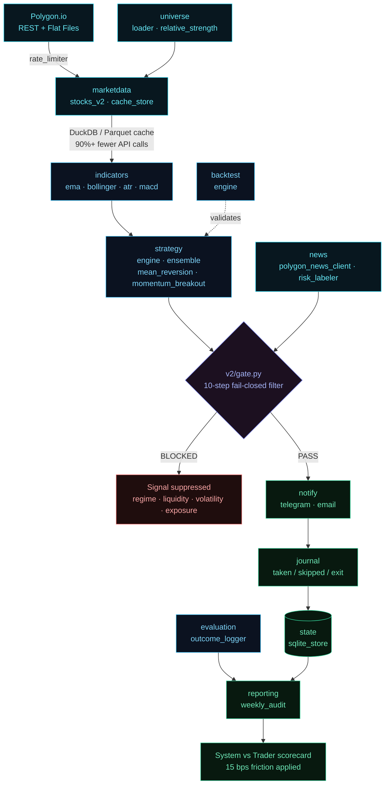

<div align="center">




<br/>

  <h1>🚀 AlphaGate</h1>
  <p><strong>The Ultimate Algorithmic Trading & Regime Gating Engine</strong></p>
  <p><em>Bridge the gap between theoretical signals and disciplined, real-world execution.</em></p>


[**Architecture**](#-system-architecture) &middot; [Why AlphaGate](#-why-alphagate) &middot; [Get Started](#-get-started-with-alphagate) &middot; [CLI](#-master-your-workflow-cli-reference)

</div>

---

## 🛑 The Problem with Most Trading Bots
Most trading systems fail in the real world. They suffer from "mid-price fantasy," ignore execution friction, blindly trade in toxic market regimes, and fail to track whether the human trader is actually following the system or sabotaging it.

## 🔑 The AlphaGate Solution
**AlphaGate** is a production-ready, professional-grade algorithmic trading workspace. It doesn't just generate signals; it enforces discipline. By combining real-time data from Polygon.io, an ultra-fast DuckDB/Parquet caching layer, and a robust **fail-closed regime gating engine**, AlphaGate ensures you only take the highest-probability setups.

---

## 🏗️ System Architecture


```mermaid
flowchart TD
    P["Polygon.io<br/>REST + Flat Files"] -->|rate_limiter| MD
    U["universe<br/>loader · relative_strength"] --> MD
    MD["marketdata<br/>stocks_v2 · cache_store"] -->|"DuckDB / Parquet cache<br/>90%+ fewer API calls"| IND
    IND["indicators<br/>ema · bollinger · atr · macd"] --> STR
    STR["strategy<br/>engine · ensemble<br/>mean_reversion · momentum_breakout"] --> GATE
    NEWS["news<br/>polygon_news_client · risk_labeler"] --> GATE

    GATE{"v2/gate.py<br/>10-step fail-closed filter"}
    GATE -->|BLOCKED| BLK["Signal suppressed<br/>regime · liquidity · volatility · exposure"]
    GATE -->|PASS| NTF["notify<br/>telegram · email"]

    NTF --> JRN["journal<br/>taken / skipped / exit"]
    JRN --> ST[("state<br/>sqlite_store")]
    EVL["evaluation<br/>outcome_logger"] --> RPT
    ST --> RPT["reporting<br/>weekly_audit"]
    RPT --> SCR["System vs Trader scorecard<br/>15 bps friction applied"]
    BT["backtest<br/>engine"] -.->|validates| STR

    classDef data fill:#08171f,stroke:#22d3ee,color:#67e8f9;
    classDef eng  fill:#0b1220,stroke:#38bdf8,color:#7dd3fc;
    classDef gate fill:#1c1020,stroke:#818cf8,color:#a5b4fc;
    classDef pass fill:#08190f,stroke:#34d399,color:#6ee7b7;
    classDef block fill:#1f0d0d,stroke:#f87171,color:#fca5a5;
    class P,U,MD,NEWS data;
    class IND,STR,BT,EVL eng;
    class GATE gate;
    class NTF,JRN,ST,RPT,SCR pass;
    class BLK block;
```

**The gate is the product.** Every candidate signal must clear all ten checks (regime, liquidity, volatility state, falling-knife detection and portfolio exposure) before it can ever reach you. Anything that fails is suppressed by default, not passed through with a warning.

---

## ✨ Why AlphaGate?

### 🛡️ Ironclad Capital Protection (Fail-Closed Gating)
Every signal must pass our rigorous 10-step **AlphaGate Filter**. If a stock is illiquid, in a panic volatility regime, or exhibiting "falling knife" characteristics, the system blocks the trade. We keep you out of toxic markets so you live to trade another day.

### ⚖️ Honest Performance Tracking (15 bps Friction Model)
Stop lying to yourself with perfect backtests. AlphaGate automatically subtracts a configurable 15 basis points (0.15%) round-trip friction cost from all calculations, accounting for real-world spread, slippage, and fees. 

### 👥 Dual-Track "System vs. Trader" Scorecarding
Are you actually a good trader, or is the algorithm carrying you? AlphaGate's weekly audit separates the structural edge of the mechanical system from your discretionary execution skill, highlighting exactly where you add value (or introduce behavioral drag).


### 🛑 Automated Portfolio Risk Governor
Eliminate correlation risk. AlphaGate strictly enforces maximum concurrent position limits (configurable), automatically suppressing new signals if your portfolio is already at maximum exposure.


## 🧠 Smart Strategy Generation

AlphaGate isn't just a gatekeeper; it's a world-class signal generator. 

* **Regime Awareness**: Classifies the market into Trend (Strong Uptrend to Strong Downtrend), Volatility (Dead, Normal, Panic), and Chop regimes.
* **Mean Reversion**: Identifies high-probability pullbacks using EMA structures, Bollinger Band extremes, and RSI exhaustion.
* **Volatility Squeezes**: Detects historical Bollinger Band compressions, alerting you just before explosive price expansions occur.
* **Smart Caching**: Reduces expensive API calls by >90% using a local DuckDB/Parquet store with REST-incremental updates.

---

## 🚀 Get Started with AlphaGate

Ready to trade with discipline? Setup takes less than 5 minutes.

### 1. Installation

```bash
# Create and activate your virtual environment
python -m venv .venv

# Windows:
.venv\Scripts\activate
# Linux/Mac:
source .venv/bin/activate

# Install the engine
pip install -r requirements.txt
```

### 2. Configure Your Environment
Provide your Polygon.io API key (Starter plan recommended) and notification preferences:

```bash
cp .env.example .env
```

Edit `.env`:
```env
POLYGON_API_KEY=your_polygon_api_key

# Optional: Get alerts directly to your phone
TELEGRAM_BOT_TOKEN=your_telegram_bot_token
TELEGRAM_CHAT_ID=your_telegram_chat_id
```

---

## 💻 Master Your Workflow (CLI Reference)

AlphaGate is built for terminal power-users.

### Analyze the Market
```bash
# Deep dive into a single stock
python main.py --symbol AAPL --timeframe 1h

# Run the live scanning engine across your entire universe
python run_live_stocks.py --universe data/universe.csv --timeframe 1h --interval 60
```

### Journal Your Trades (`src.journal`)
Hold yourself accountable the moment a signal fires.
```bash
# Log a taken trade with your exact entry
python -m src.journal mark --alert-id 42 --taken --entry 150.25 --stop 147.50 --note "A+ Setup"

# Log a disciplined skip
python -m src.journal mark --alert-id 43 --skipped --reason NEWS_RISK --note "Earnings tomorrow"

# Close the loop
python -m src.journal exit --alert-id 42 --exit-price 155.80
```

### Face the Music (Weekly Audits)
Generate the ultimate truth-teller report.
```bash
# Run your weekly performance review
python -m src.reporting.weekly_audit --lookback-days 7
```

**What you'll see:**
```text
========================================================================
📊 SYSTEM Performance (Mechanical + 15.0 bps Friction)
========================================================================
   Total P&L:        $+245.50
   Win Rate:         62.3% 

========================================================================
👤 TRADER Performance (Actual Fills + 15.0 bps Friction)
========================================================================
   Total P&L:        $+310.20
   Win Rate:         70.0% 
```

---

## 🛠️ Extensible Architecture

AlphaGate is modular and built to scale. Dive into the core files:

* **[gate.py]**: The brain of the fail-closed regime filter.
* **[weekly_audit.py]**: The dual-track audit engine.
* **[stocks_v2.py]**: The resilient DuckDB cache layer.
* **[config.yaml]**: Your central command for tweaking indicator sensitivity and risk limits.

---

## ✅ Production Verified

AlphaGate is backed by a comprehensive test suite guaranteeing indicator math, cache integrity, and gating logic. 

```bash
# Verify the engine
.venv\Scripts\pytest -v
```
*Currently passing 185/185 tests in under 20 seconds.*

---

## ⚖️ Disclaimer
AlphaGate is a powerful analysis and execution-support tool built for **educational and research purposes**. Algorithmic trading involves significant financial risk. Always verify setups manually and test extensively with paper trading before allocating live capital. Past performance does not guarantee future results.
